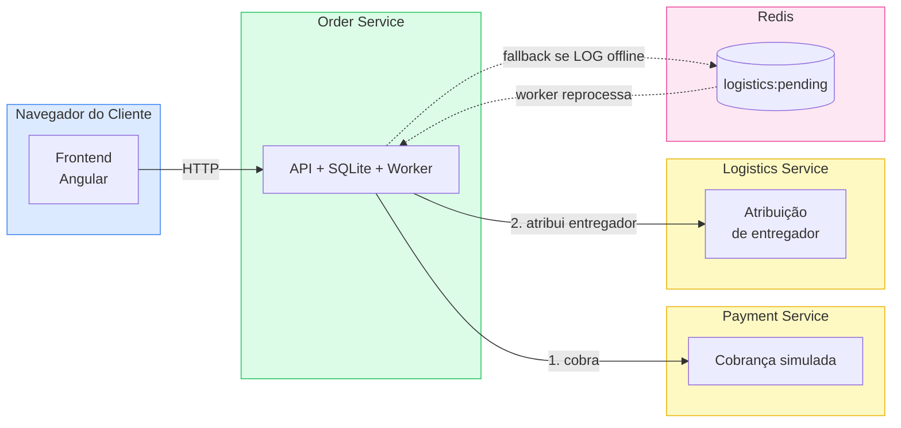
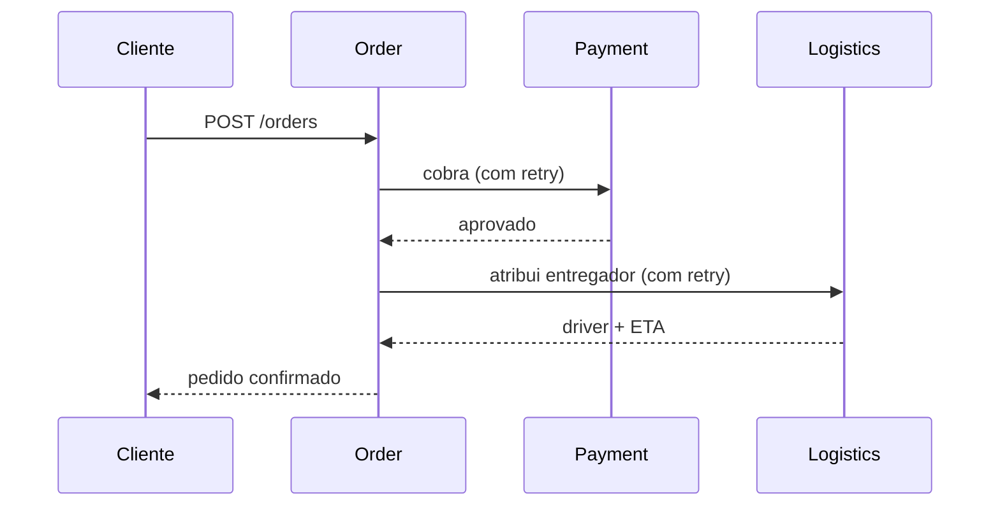
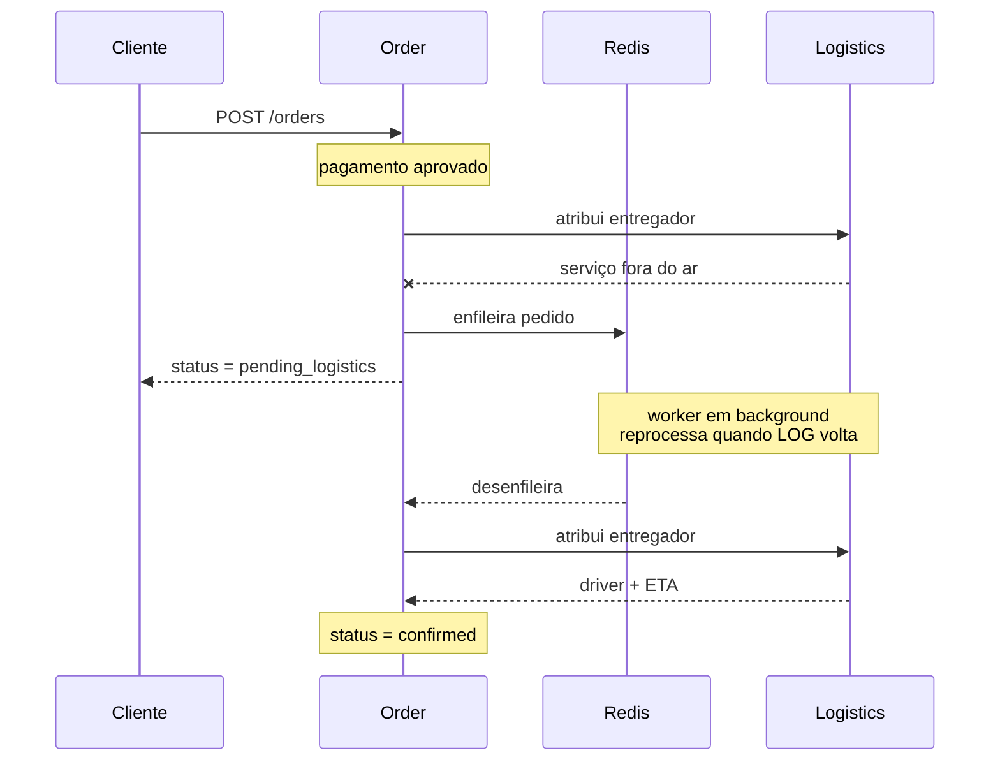

# Delivery — Sistemas Distribuídos

Sistema de delivery distribuído com resiliência, filas assíncronas e idempotência, desenvolvido como trabalho prático da disciplina de Sistemas Distribuídos (N1-02).

---

## Visão Geral

A aplicação simula um fluxo completo de pedido de delivery, desde a navegação no cardápio pelo cliente até a atribuição de um entregador. O sistema é composto por um frontend Angular e três microsserviços Python independentes, orquestrados via Docker Compose, com Redis como fila de mensagens para garantir resiliência na comunicação entre serviços.

### Funcionalidades principais

- Listagem de restaurantes e cardápios
- Carrinho de compras e checkout
- Acompanhamento de status do pedido em tempo real
- **Retry automático** com backoff exponencial nas chamadas de pagamento
- **Fallback para fila Redis** quando o serviço de logística está indisponível
- **Idempotência** — reenvio do mesmo `order_id` não gera cobranças duplicadas
- Worker em background que reprocessa pedidos pendentes de logística

---

## Diagrama Arquitetural

Visão simplificada da comunicação entre os serviços:



| Componente | Porta | Responsabilidade |
|------------|-------|------------------|
| Frontend (Angular) | 80 | Interface do cliente |
| Order Service | 5001 | Recebe pedidos, orquestra pagamento e logística, persiste em SQLite |
| Payment Service | 5002 | Simula cobrança (delay 2–4s, 10% de recusa) |
| Logistics Service | 5003 | Atribui entregador e ETA |
| Redis | 6379 | Fila `logistics:pending` para retry assíncrono |

### Fluxo de um pedido

Caminho feliz (tudo funciona):



Caminho com falha (logística indisponível → fila Redis):



Resumo dos status:

```
payment_processing ─┬─► payment_failed              (pagamento recusado)
                    └─► logistics_assigning ─┬─► confirmed / delivered
                                             └─► pending_logistics ─► confirmed
                                                      (via fila Redis)
```

---

## Tecnologias

| Camada | Tecnologia |
|--------|-----------|
| Frontend | Angular 17, PrimeNG, Bootstrap Icons, RxJS, SCSS |
| Backend | Python 3.11, Flask 3, Flask-CORS |
| Resiliência | Tenacity (retry + backoff exponencial) |
| Banco de dados | SQLite (persistido em volume Docker) |
| Fila / Cache | Redis 7 |
| Servidor web | Nginx Alpine (produção do frontend) |
| Orquestração | Docker Compose |

---

## Pré-requisitos

- [Docker](https://docs.docker.com/get-docker/) ≥ 24
- [Docker Compose](https://docs.docker.com/compose/) ≥ 2 (já incluído no Docker Desktop)

> Não é necessário ter Python, Node.js ou Redis instalados localmente — tudo roda dentro dos containers.

---

## Como rodar

### 1. Clonar o repositório

```bash
git clone <url-do-repositório>
cd sistemas-distribuidos
```

### 2. Subir toda a stack

```bash
docker compose up --build -d
```

O comando constrói as imagens e inicia os cinco serviços em segundo plano. Na primeira execução o build pode levar alguns minutos.

### 3. Verificar se todos os serviços estão saudáveis

```bash
docker compose ps
```

Todos os containers devem aparecer com status `healthy`. Se algum ainda estiver em `starting`, aguarde mais alguns segundos.

### 4. Acessar a aplicação

| Serviço | URL |
|---------|-----|
| **Frontend** (UI completa) | <http://localhost> |
| Order Service (API) | <http://localhost:5001> |
| Payment Service (API) | <http://localhost:5002> |
| Logistics Service (API) | <http://localhost:5003> |

---

## Variáveis de ambiente

As variáveis já estão configuradas no `docker-compose.yml`. Para rodar os serviços individualmente fora do Docker, configure:

| Variável | Padrão | Descrição |
|----------|--------|-----------|
| `PAYMENT_SERVICE_URL` | `http://localhost:5002` | URL do Payment Service |
| `LOGISTICS_SERVICE_URL` | `http://localhost:5003` | URL do Logistics Service |
| `DATABASE_PATH` | `./orders.db` | Caminho do banco SQLite |
| `REDIS_URL` | `redis://localhost:6379` | URL do Redis |

---

## Endpoints da API

### Order Service (`localhost:5001`)

| Método | Rota | Descrição |
|--------|------|-----------|
| `GET` | `/health` | Health check |
| `POST` | `/orders` | Cria um novo pedido |
| `GET` | `/orders/:order_id` | Consulta pedido por ID |

**Exemplo — criar pedido:**

```bash
curl -s -X POST http://localhost:5001/orders \
  -H "Content-Type: application/json" \
  -d '{
    "customer": "João Silva",
    "restaurant": "Sakura Japanese",
    "items": [
      {"id": "s1", "name": "Sashimi de Salmão", "quantity": 2, "price": 42.90}
    ],
    "total": 85.80
  }' | python3 -m json.tool
```

Veja o resumo dos status no [Fluxo de um pedido](#fluxo-de-um-pedido).

### Payment Service (`localhost:5002`) e Logistics Service (`localhost:5003`)

Ambos expõem `GET /health`. São chamados internamente pelo Order Service — não é necessário acessá-los diretamente.

---

## Roteiro de testes

O arquivo `demo-roteiro.sh` executa automaticamente todos os cenários de teste:

```bash
bash demo-roteiro.sh
```

Os cenários cobertos são:

1. **Pedido normal** — demonstra retry no pagamento (delay simulado de 2–4s)
2. **Fallback de logística** — derruba o `logistics-service` e mostra status `pending_logistics` + enfileiramento no Redis
3. **Recuperação** — restaura o serviço e observa o worker reprocessar a fila
4. **Idempotência** — envia o mesmo `order_id` duas vezes e verifica que o pedido não é duplicado

Para acompanhar os logs em tempo real durante os testes:

```bash
docker logs -f order-service
```

---

## Parar os serviços

```bash
docker compose down
```

Para remover também os volumes (banco de dados e dados do Redis):

```bash
docker compose down -v
```

---

## Estrutura do projeto

```
sistemas-distribuidos/
├── docker-compose.yml
├── demo-roteiro.sh
├── frontend/                  # SPA Angular 17
│   ├── Dockerfile
│   ├── nginx.conf
│   └── src/
│       └── app/
│           ├── pages/         # restaurant-list, menu, cart, checkout, order-tracking
│           ├── services/      # cart.service, order.service
│           └── models/        # cart, order, restaurant
├── order-service/             # Orquestrador de pedidos
│   ├── app.py
│   ├── routes.py
│   ├── models.py
│   ├── resilience.py          # call_with_retry (tenacity)
│   ├── queue_worker.py        # Worker Redis (BLPOP)
│   ├── requirements.txt
│   └── Dockerfile
├── payment-service/           # Simulador de pagamento
│   ├── app.py
│   ├── requirements.txt
│   └── Dockerfile
└── logistics-service/         # Simulador de logística
    ├── app.py
    ├── requirements.txt
    └── Dockerfile
```
